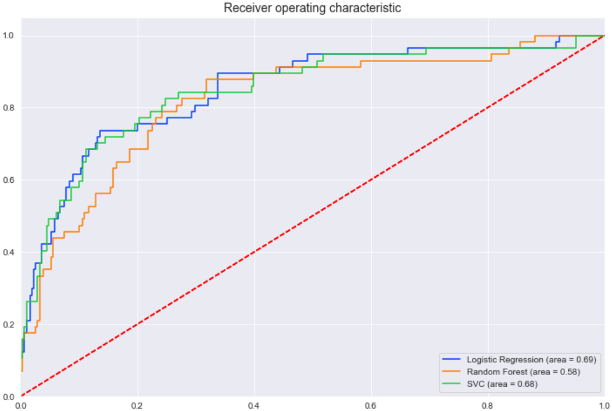
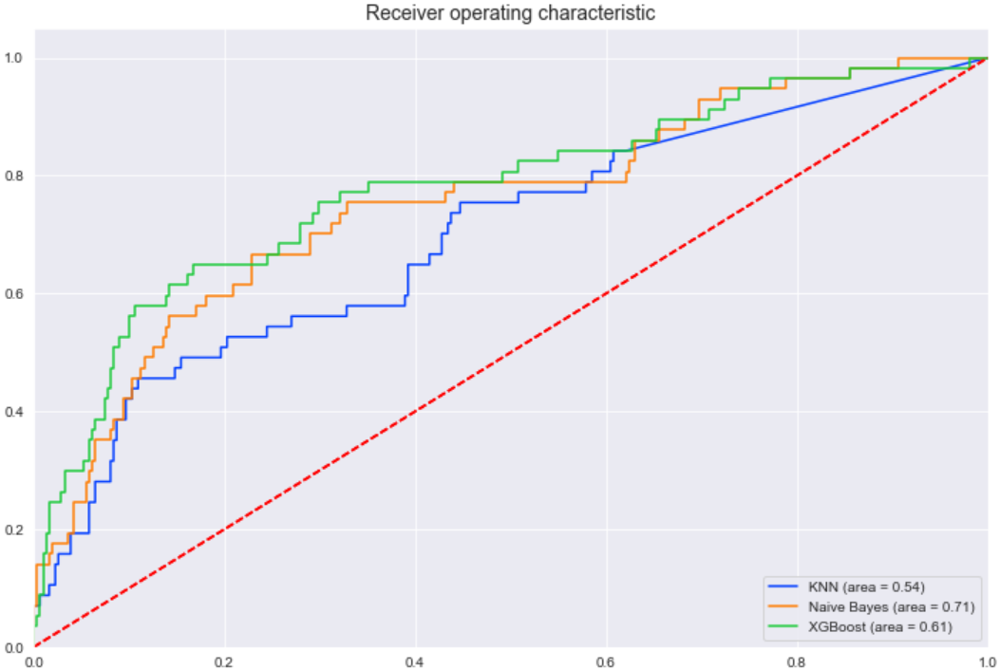
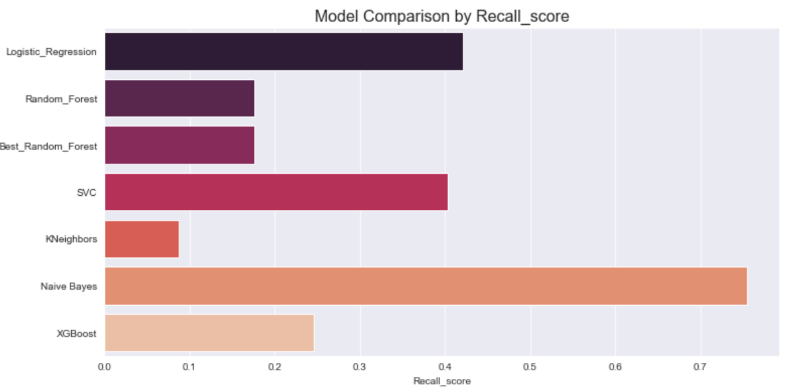
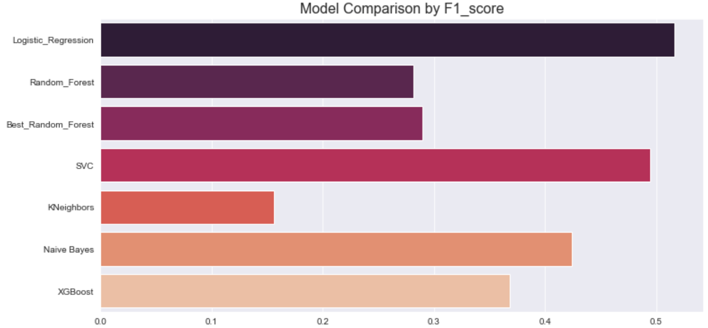
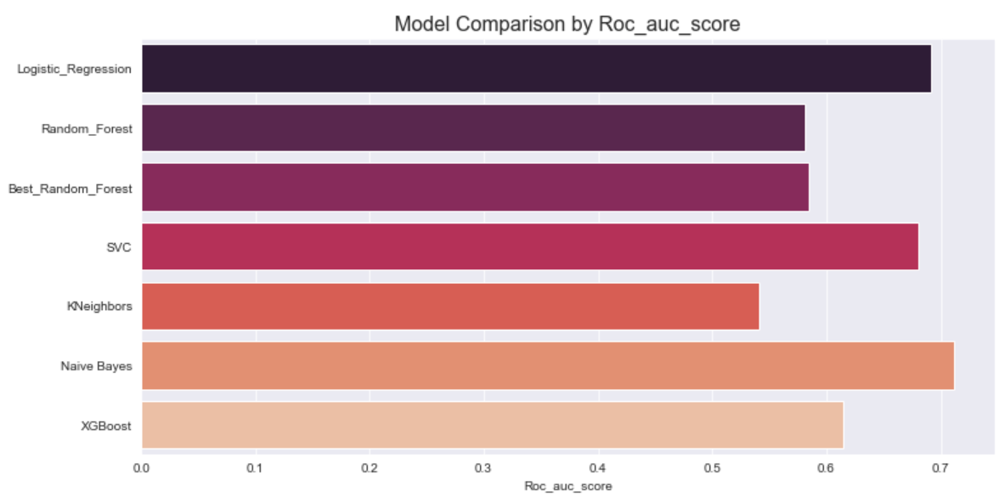

# Human Resourses Attrition Analysis (EDA + sklearn models)

## The dataset consists of employees' data ("age", "distance from home", "education", "monthly income" and 30 more rows...)

#### Explarotary data analysis was carried out in order to understand some key factors (and find some key features) why eployees suffer from attrition and how to detect it. 

# ----------------------------------------------------------------

# Data Exploration

* Loaded data and dropped unimportant columns (ones that had only one unique value).

# Data Analysis 

* Plotted all numeric columns to see the distribution od data;

* Plotted charts of Attrition vs Department, JobLevel, Gender, JobRole, PercentSalaryHike;

* Plotted distribution of TotalWorkingYears, Age and MonthlyIncome by Gender;

* After getting familiar with the data, should plot Correlation Matrix to find important correlations and interesting facts;

* Marked some important correlations as:
	 * MonthlyIncome vs JobLevel;
	 * JobLevel, MonthlyIncome, TotalWorkingYears vs Age;
	 * PerformanceRanting vs PercentSalaryHike;
	 * TotalWorkingYears vs JobLevel vs MonthlyIncome.

* Plotted non-obvious correlations;

# Data Preprocessing

* Encoded categorical columns into numeric;

* Standardized data using StandardScaler

* Splited data to train and test

# Training Models
## Didn't use "accuracy" due to high imbalance in classes (1233 non-attrition vs 237 attrition)

### Logistic Regression 
* Precision_score: 0.667
* Recall_score: 0.421
* F1_score: 0.516
* Roc_auc_score: 0.691

### Random Forest
* Precision_score: 0.714
* Recall_score: 0.175
* F1_score: 0.282
* Roc_auc_score: 0.581

### Grid Search Random Forest
* Precision_score: 0.833
* Recall_score: 0.175
* F1_score: 0.289
* Roc_auc_score: 0.585

### SVC
* Precision_score: 0.639
* Recall_score: 0.401
* F1_score: 0.495
* Roc_auc_score: 0.681

### KNN
* Precision_score: 0.714
* Recall_score: 0.089
* F1_score: 0.156
* Roc_auc_score: 0.541

### Naive Bayes
* Precision_score: 0.295
* Recall_score: 0.754 
* F1_score: 0.242
* Roc_auc_score: 0.712

### XGBoost
* Precision_score: 0.737
* Recall_score: 0.246
* F1_score: 0.368
* Roc_auc_score: 0.615

# Plotting and Comparing Results

##### Roc Auc Curve for Logistic Regression, Random Forest and SVC

##### Roc Auc Curve for KNN, Naive Bayes and XGB

##### Precision Score

##### Recall Score 

##### F1 Score

##### Roc Auc Score

# Summary

* Precision score: Grid Search Random Forest Classifier gained best result (0.818). XGBClassifier also did well (0.737), but the rest of the models didn't show such results. Naive Bayes got less than 0.3;

* Recall score: Naive Bayes became a complete winner with the result of 0.754. Other models were not even close;

* F1 score: Logistic Regression and linear SVC are the leaders with scores of 0.516 and 0.495 respectively. The rest of the models can't be proud of their results;

* Roc auc score: Naive Bayes and Logistic Regression are the leaders as well with scores of 0.712 and 0.691 respectively. SVC got almost the same results as Logistic Regression (0.681).