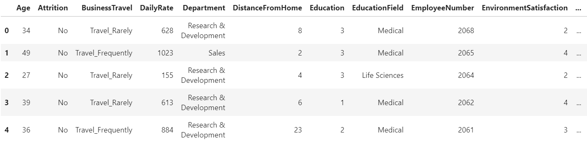

# The following dataset consists of 1470 rows and 34 columns:

### 1 row states for 1 employee

### Previev

#### Column meaning
| Education           | EnvironmentSatisfaction | JobInvolvement  | JobSatisfaction | PerformanceRating | RelationshipSatisfaction | WorkLifeBalance |
|---------------------|-------------------------|-----------------|-----------------|-------------------|--------------------------|-----------------|
| 1 - "Below College" | 1 - "Low"               | 1 - "Low"       | 1 - "Low"       | 1 - "Low"         | 1 - "Low"                | 1 - "Bad"       |
| 2 - "College"       | 2 - "Medium"            | 2 - "Medium"    | 2 - "Medium"    | 2 - "Good"        | 2 - "Medium"             | 2 - "Good"      |
| 3 - "Bachelor"      | 3 - "High"              | 3 - "High"      | 3 - "High"      | 3 - "Excellent"   | 3 - "High"               | 3 - "Better"    |
| 4 - "Master"        | 4 - "Very High"         | 4 - "Very High" | 4 - "Very High" | 4 - "Outstanding" | 4 - "Very High"          | 4 - "Best"      |
| 5 - "Doctor"        |                         |                 |                 |                   |                          |                 |

#### Column Type
Column | Data type
--- | --- 
Age | int
Attrition | category
BusinessTravel | category
DailyRate | int
Department | category
DistanceFromHome | int 
Education | int 
EducationField | category
EmployeeNum | int
EnvironmentSatisfaction | int 
Gender | category
HourlyRate | int 
JobInvolvement | int 
JobLevel | int 
JobRole | category
JobSatisfaction | int 
MaritalStatus | category 
MonthlyIncome | int 
MonthlyRate | int 
NumCompaniesWorked | int 
Over18 | category
OverTime | category
PercentSalaryHike | int 
PerformanceRating | int 
RelationshipSatisfaction | int 
StandardHours | int 
StockOptionLevel | int 
TotalWorkingYears | int 
TrainingTimesLastYear | int 
WorkLifeBalance | int 
YearsAtCompany | int 
YearsInCurrentRole | int 
YearsSinceLastPromotion | int 
YearsWithCurrManager | int